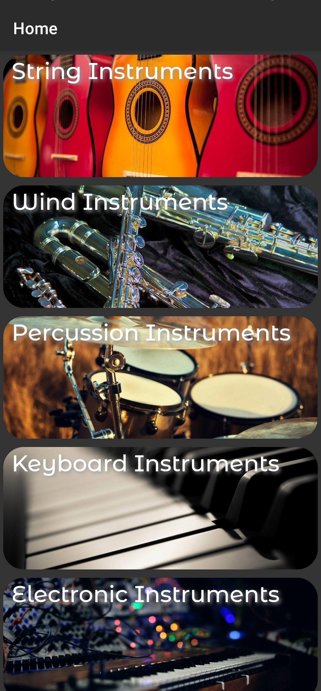
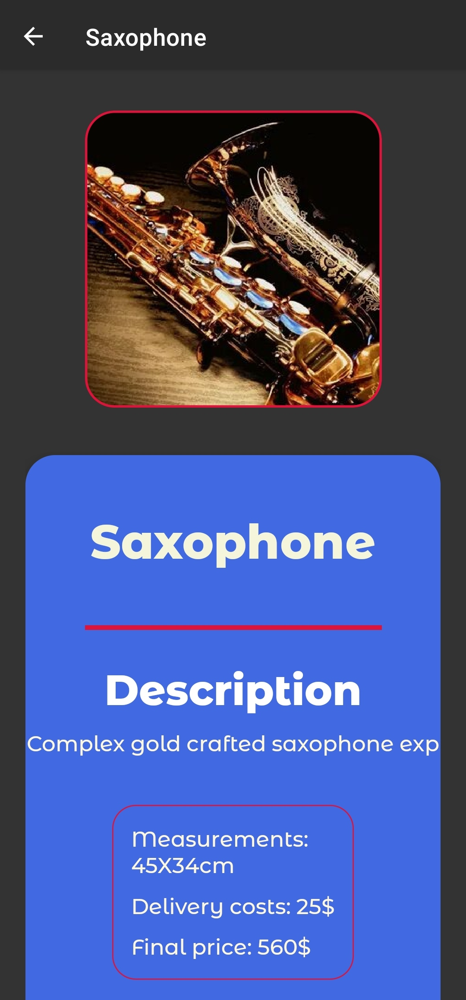
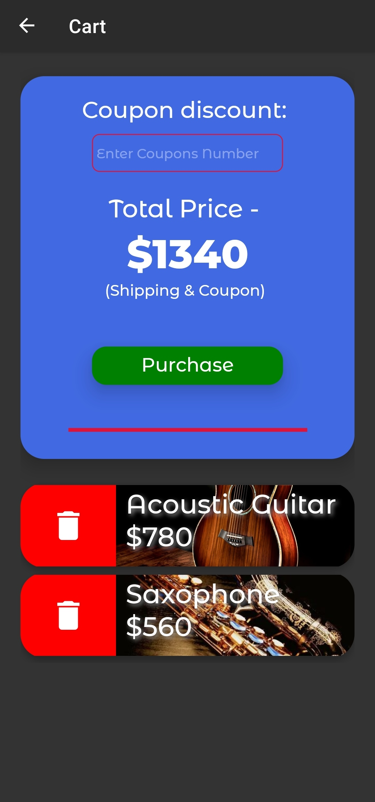
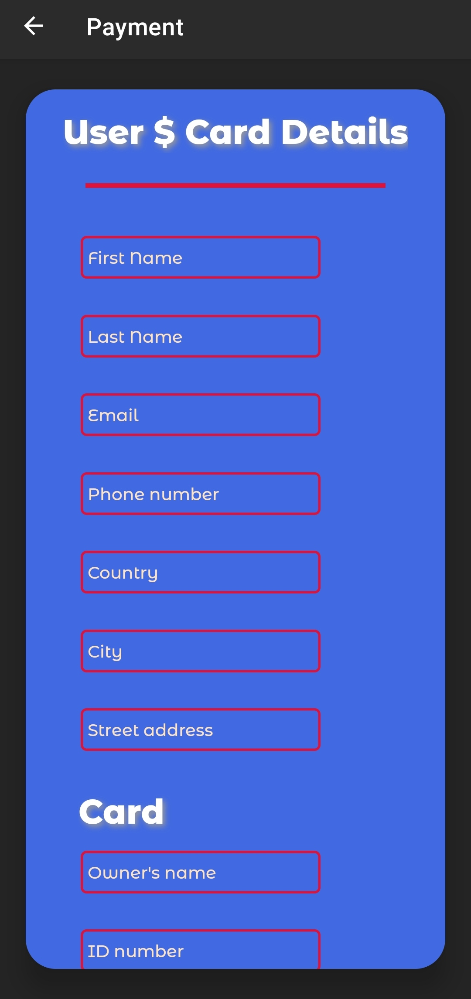
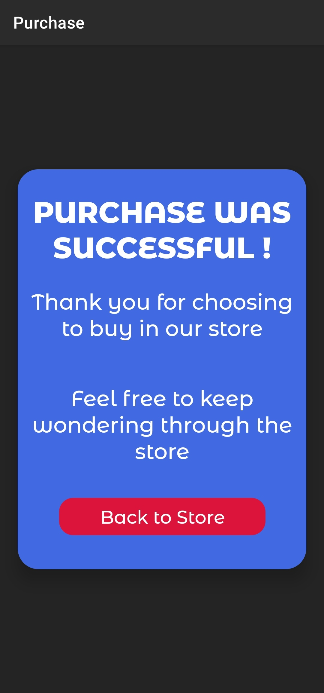

# README
---
## Music Store - React Native (expo)

> NOTE: ALL RIGHTS RESERVED to Avial Yisrael (Cohen)

Small project of a Music Instruments Store. 

### Build - UP
- Stack Navigation
- Hooks
- IconMaterial
- Input validation lib 
- Custom fonts (Google)

 

##### Uploaded with 'dummy-data' for testing...

 

>#### **Coupon codes are:**
> * **_789456123_** - 10% discount
> * **_987876765_** - 15% discount
> * **_234345456_** - 25% discount

---

## ScreenShots - 
## **1. HOME PAGE**

  

## **2. CATEGORY PAGE**

  

## **3. PRODUCT PAGE**

  

## **4. CART PAGE**

  

## **5. PAYMENT DETAILS PAGE**

  

## **6. PURCHASED MADE PAGE**

  

---

  

### Installation - 

Download code, extract and run in *terminal* (under right path of file).
run `npm install` in terminal and it will install dependencies..
Afterwards run `expo start` and enjoy the app!

>Did you run into a problem? I would like to hear about it: avicop@gmail.com

 

**_made by A.C.Y enjoy_**
---

[MD - CheatSheet](./assets/md-CheatSheet.png)

